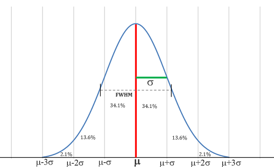

# Data And Sampling Distributions

## Key Terms:
- Sample: A subset from a larger data set.
- Population: The larger data set or idea of a data set.
- N (n): The size of population (sample).
- Random Sampling: Drawing Elements into a sample at random.
- Stratified Sampling: Dividing the population into strata and randomly sampling from each strata.
- Stratum (pl., strata): A homogenenous subgroup of a population with common characteristics.
- Simple Random Sample: A sample tjat results from random sampling without straifying the population.
- Bias: Systematic error.
- Sample Bias: A sample that misrepresents the population.
- Selection Bias: Bias resulting from the way in which observations are selected.
- Data Snooping: Extensive hunting through data in search of something interesting.
- Vast Search Effect: Bias or non-reproducability resulting from repeated data modeling, or modeling data with large numbers of predictor variables.
- Sample statistic: A metric calculated for a sample of data drawn from a larger population.
- Data distribution: Frequency distribution of individual values in a data set.
- Sampling Distribution: The frequency distribution of a sample statistic over many samples or resamples.
- Central Limit Theorem: Tendency for sampling distribution to take on a normal shape as sample size rises.
- Standard Error: The variability of a sample statistic over many samples. It is a single metric that sums the variability in the sampling distribution as for a statistic. SE = s/sqrt(n)

## Regression To the Mean Phenomenon
- A phenomenon involving successive measurements on a given variable -> Extreme observations tend to be followed by more central ones. It is a 

## Bootstrap
An easy and effective way to estimate the sampling distribution of a statistic, or of model parameters, is to draw additional samples with replacement, from the sample itself and recalculate the statistic or model for each resample. This is known as bootstrap. 
Bootstrap can be used with multivariate data, where rows are samples as units. A model may be run on the bootstrapped data, for example, to estimate the stability (variability) of model parameters, or to improve predective power. With classification and regression trees, running multiple trees on bootstrap samples and then averaging their predictions generally performs better than using a single tree. This process is called bagging or bootstrap aggregating.

## Resampling vs Bootstraping
- Resampling comprises of permutations and sampling without replacements, whereas bootstrap requires replacement.

## Confidence Intervals
- A way to understanc potential error in a sample estimate.
- Confidence Level: The percentage of confidence intervals, constructed in the same way from the same population, that are expected to contain the statistic of interest.
- C.I gives us a way to present an estimate not as a single number but as a range.
- An x% confidence interval around a sample estimate should on averge contain similar sample estimates x% of the time (when similar sampling procdeure is followed).

## Normal Distribution / Gaussian Distribution.
- Bell shaped distribution.
- Error: Difference between a data point and a predicted or average value.
- Standardize: Subtract the mean and divide by the standard deviation.
- z-score: The result of standardizing an individual data point
- Standard Normal: A normal distribution with mean = 0 and standard deviation = 1.
- QQ plot: A plot to visualize how close a sample distribution is to a specified distribution, e.g. to the normal distribution.

- To compare data to a standard normal distribution, you subtract the mean and then divide by the standard deviation; this is also called normalization or standardization. The transformed value is termed a z-score, and the normal distribution is sometimes called the z-distribution.
- A QQ plot orders the z-score from low to high and plots each values z-score on the y axis; th ex axis is the corresponding quantile of a normal distribution for the value's rank. Since the data is normalized the points each value corresponds to the number of standard deviations away from the mean. If the points roughly fall on the diagonal line, then sample distribution can be considered close to normal.

## Long-Tailed Distribution
-  Data is generally not normally distributed.
-  Tail: The long narrow portion of a frequencey distribution, where relatively extreme values occur at a low frequency.
-  Skew: Where one tail of a distribution is longer than the other.
-  Sometimes distribution os highly skewed, such as with income data.
-  Nassim Taleb has proposed the black swan theory, which predicts that anomalous events, such as stock market crash, are more likely to occur than would be predicted by the normal distribution.

## T-Distribution
- T-distribution is a normally shaped distribution, except that it is a bit thicker and the longer on the tails. It is used extensively in depicting distributions of sample statistics. The larger the sample the more normally shaped the t-distribution becomes.
- n: sample size.
- Degrees of freedom: A parameter that allows the t-distribution to adjust to different sample sizes, statistics, and number of groups.

## Binomial Distribution
- Trial: An event with a discrete outcome.
- Success: The outcome of interest of a trial
- Binomial: Having 2 outcomes only.
- Binomial Trial / Bernoulli Trial: A trial with 2 outcomes.
- Binomial Distribution / Bernoulli Distribution: Distribution of number of successes in x trials. It is the frequency distribution of number of sucesses in a given number of trials with specidied probability of success in each trial.
- The mean of a binomial distribution is p*n; expected number of successes in n trials with probability p.
- The variance is n * p * (1-p).
- With a large number of trials Binomial distribution is virtually indistinguishable from the normal distribution.

## Chi-Square Distribution
- An important idea in statistics is departure from expectation, especially with respect to category counts. Expectation is defined loosely as nothing unusual or of note in the data. This is also termed the null hypothesis or null model. The statistic that measures the extent to which the results depart from the null expectation of independence is the chi-square statistic.
- Chi square statistic is a measure of the extent to which a set of observed values fits a specified distribution (goodness of a fit test).
- The chi square distribution is the distribution of the chi square statistic under a repeated resample draws from the null model. Low chi square metric means closer to distribution and vice versa.

## F Distribution
- The F statistic compares variation due to  factors of interest to overall variance. (ANOVA / Analysis o f variance).
- F distribution is used with experiments and linear models involving measured data.

## Poission And Related Distributions
- Lambda: The rate per unit of time or space at which an event occurs.
- Poisson Distribution: Frequency distribution  of the number of events in sampled units of time or space.
- Exponential Distribution: The frequency distribution of the time or distance from one even to the next event.
- Weibull Distribution: A generalized version of the exponential distribution in which the event rate is allowed to shift over time/ not constant.
- The possion distribution is useful for anwering queueing questions such as: How much capacity do we need to be 95% sure of fully processing the internet traffic that arrives on a server in any five second period.
