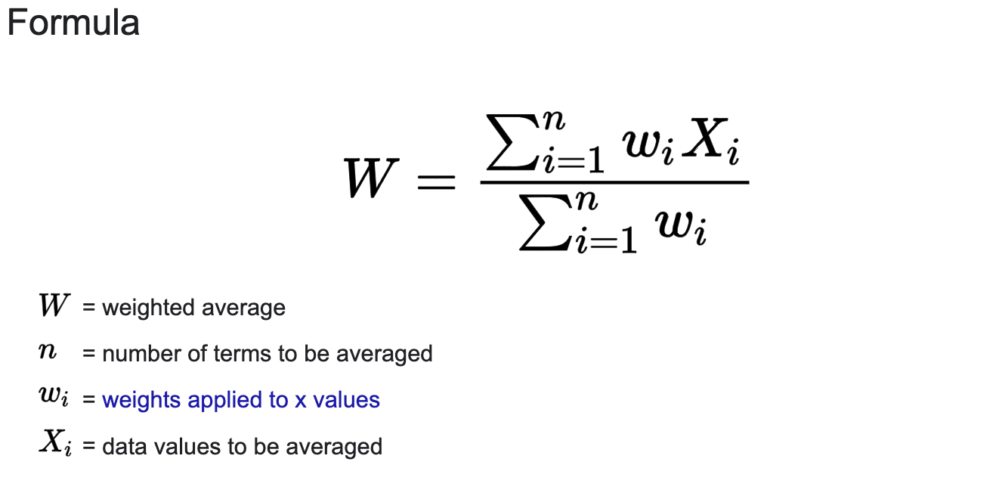
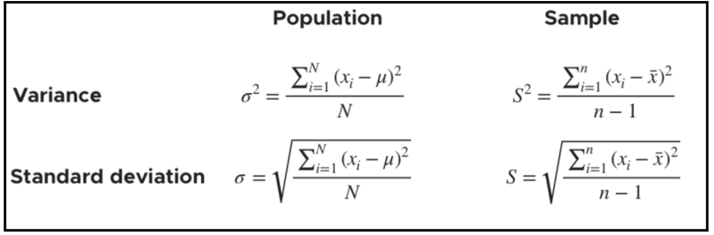
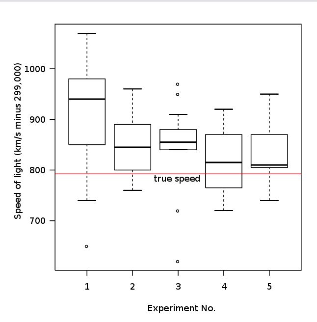
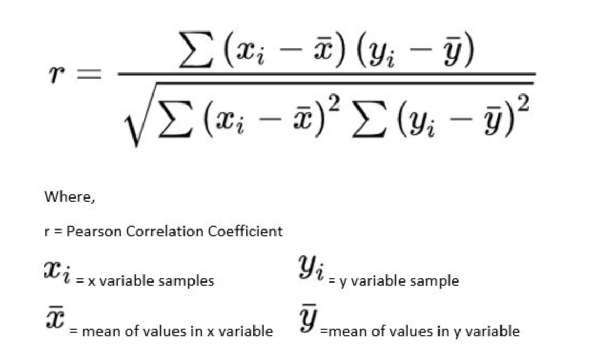
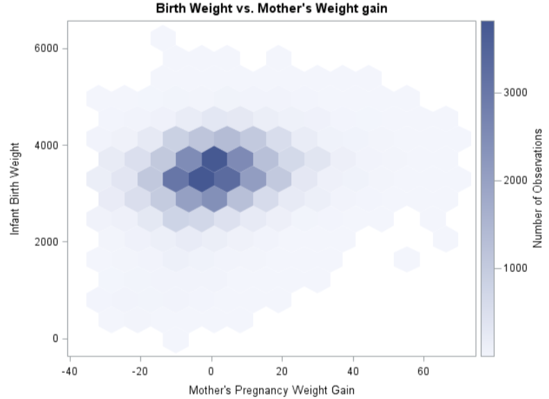

# Data Exploration

## Data Types:
- Numeric:
  - Conitnuous (can take any value on an interval)
  - Discrete (Only integer value such as counts)/
- Categorical:
  - Binary(only two values for category) && Ordinal (explicit ordering)

## Location and Estimates for Location
- Location: Considered a basic step for exploring data and getting a typical value from your data set.
- Examples of Estimates of location:
  - Mean/AVG (Sum of vals divided by number of vals).
  - Weighted Mean (Sum of all vals times a weight divided by sum of weights).
  - Median/50th percentile (The value such that one half od the data lies below it)
  - Percentile/Quantile (The value such that P percent of the data lies below it)
  - Weighted Median (The value such that one half of the sum of the weights lies above and below the sorted data)
  - Trimmed Mean/Truncated mean (Mean after dropping a fixed number of extreme values)

**Robustness of a metric refers to it not sensitive to extreme values**

- Mean is not robust => making it a trimmed mean can help eliminate the influence of extreme values

- Weighted mean is represented as 
The motivation behind weighted mean is that some values are intrinsically more variable than others, and highly variable observations are given a lower weight. Example, if we are getting data from a n sensors and the n2 sensor is not very accurate, we can lower the weight for the data from the n2 sensor (downweight).
Another reason for weighted mean use if when the data collected does not equally represent the different groups that we are interested in measuring. For example, because of the way an online experiment was conducted, we may not have a set of data accurately reflecting all groups in the user base. To correct this, we give higher weight to the values from the groups that were underrepresented.

- Median is considered robust because it only accounts for the middle value in the dataset, no matter how high or low the extreme values will be the element ordering does not change and hence not get affected by the extreme values on both ends. The weighted median is also robust for similar reasons.

- A common choice for robust metrics are medians and trimmed mean. A common choice percent of trimming for mean is the top and bottom 10%. The trimmed mean is often thought of as the compromise between median and the mean, since it is robust to extreme values is the data but uses more data to calculate the estimate for location.

## Variabililty and Estimates for Variability
- Another dimension to explore your dataset/features is the variability/dispersion/how tightly coupled or spread out the values are.
- Estimates of variability
  - Deviations/errors/residuals: The difference between observed values and the estimate of location.
  - Variance/mean-squared-error: Sum of squared deviations from the mean divided by n - 1 where n is the number of data values.
  - Standard Deviation: Square root of variance.
  - Mean Absolute Deviation/L1 Norm/Manhattan Norm: Mean of absolute values of the deviations from the mean.
  - Range: Difference between largest and smallest value in a dataset.
  - Order Statistics / Rank: Metrics based on the data values sorted from largest ti smallest.
  - Percentile: Percentile/Quantile (The value such that P percent of the data lies below it).
  - Interquartile Range/IQR: Difference between 75th percentile and 25th percentile.

- Standard deviation is the most widely used estimate of variation. 
- Neither Standard Deviation, Mean Absolute Deviation, nor Variance are robust to outliers.
- A robust estimate of variability is the median absolute deviation from the median. Also known as MAD.
- Median Absolute Deviation = Median(|xi - m)) For i = 0 to n. Where m is the median.
  

- Estimates based on percentiles:
  - Percentile calculation can be used to measure variance such as the IQR/ difference b/w 75th and 25th percentile. Because percentiles need sorted data this counts as order statistics. It can be computationally expensive to compute, and hence special algorithms such as Zhang-Wang-2007 were developed.

## Exploring Data Distribution
- Boxplot/whoskers plot: Visually represent percentiles on data.
- Frequency table: Tally count of data that falls into bins.  
- Histogram: Put the bins from a frequency table on x axis and the tally count on y axis.
- Density plot: Smoothen out the histogram, and make the yaxis proprotions instead of values. This means that the area under the density plot always equals 1.

## Exploring Binary and Categorical Data
- Terms:
  - Mode: Most commonly occuring category or value in a dataset.
  - Expected Value: When the categories can be associated with a numeric value, this gives an avergae value based on a category's probabiility of occurence.
  - Bar charts: Frequency or porportions for each category plotted as bars.
  - Pie Charts: Frequency or porportions for each category plotted as a wedges in a pie.

- Expected Value:
  - Multiply each outcome by it's probability of occurence and then sum these values up.
  - Example: A company offers 2 services A & B. A costs $300/month and B costs $200/month. There is a free webinar and 5% attendees sign up for service A and 15% will sign up for B and 80% will sign up for nothing. This means that the Expected Value from an Attendee can be calculated as:
    - (0.05 * 300) + (0.15 * 200) + (0.8 * 0) = 45.0
  - Expected calue is a fundamental concpet in business validation and capital budgeting. Example: The E.V of five years of profits from a new acquisition.

- Correaltion:
  - Positive correlation b/w x and y: if x goes up then y goes up, if x goes down y goes down.
  - Negative correlation b/2 x and y: if one goes up then the other goes down.
  - Exploratory data analysis often involves examining correlation among predictors, and between predictors and a target variable.
  - Correlation Coefficient: Rnaging -1 to 1 this measure the extent to which numeric variables are associated with each other.
  - Correlation Matrix: A table where the variables are shown on both rows and columns and the cell values are the correlations between the variables.
  - Scatterplot: A plot in which x axis has value of one variable, and y axis has the value of another.
  - Pearson's correlation coefficient: 
  - Variables can have an association that is not linear in which case the correlation coefficient may not be a useful metric.

## Exploring Two Or More Variables (Multivariate Analysis)
- Everything above this looks at a single variable or compares it against another! Multivariate analysis is exploring multiple "columns" at once.
- Terms:
  - Contingency Table: A tally of counts between or more categorical variables.
  - Hexagonal Binning: A plot fo two numeric variables with the records binned into hexagons.
  - Contour Plot: A plot showing the density of two numeric variables like a topographical map.
  - Violin Plot: Similar to boxplot but showing the density estimate.

### Hexagonal Binning and Contours
- When the data points grow from relatively small number to hundreds of millions of records a scatterplot becomes too dense to give accurate visuals. So, instead of plotting points, which appear as one big dark dot on the plot, we group records into hexagonal bins and plotted the hexagons with a color indicating the number of records in that bin.
- 
- Other ways to visualize similar data can be heatmaps and contour plots. They all give a a visual representation of 2 dimensional density. 

### Two Categorical Variables
- A contingency table can be used to summarized 2 categorical variables.
- It is a table of counts by category. Also known as a pivot table.
